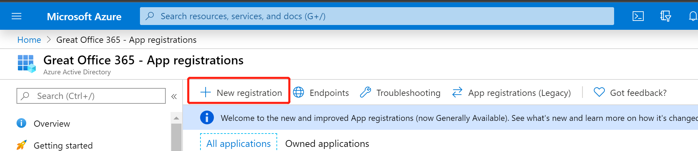
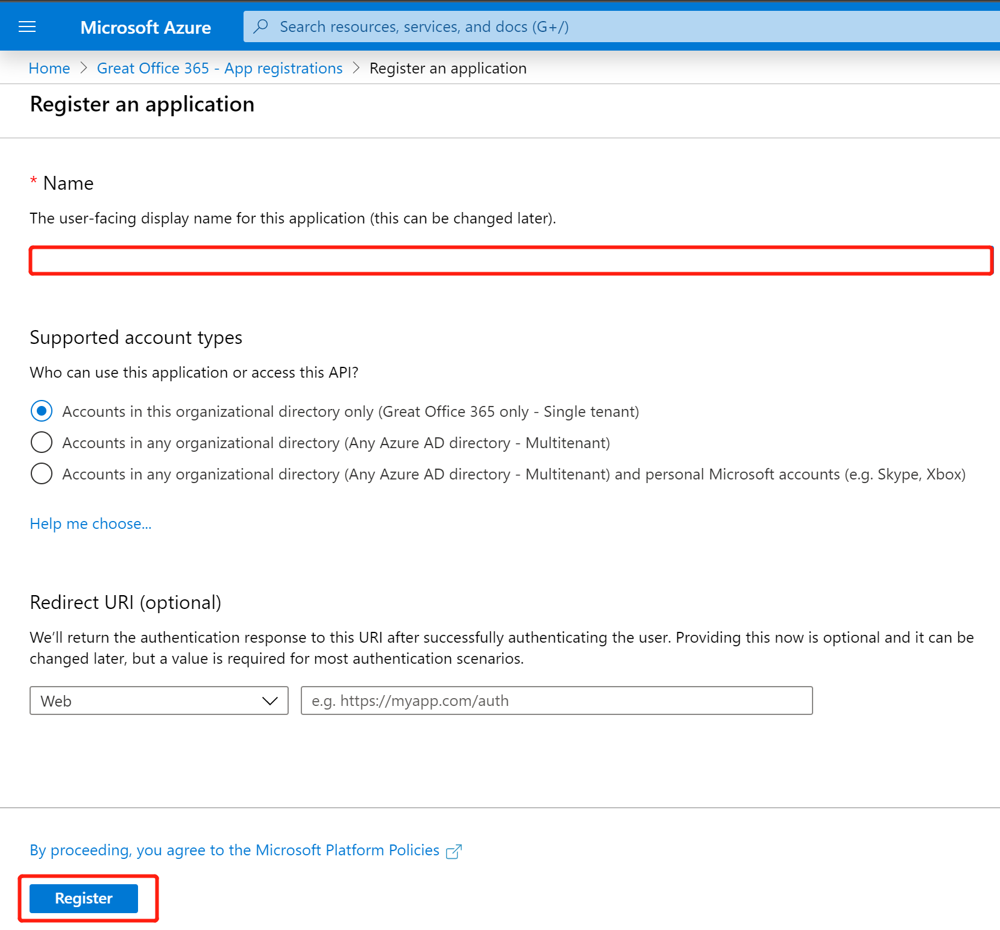
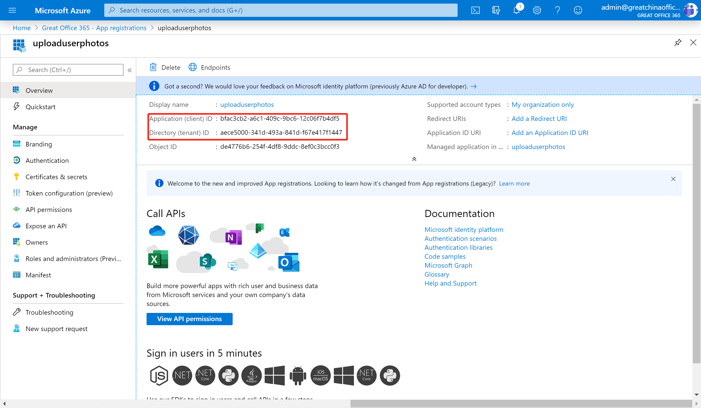
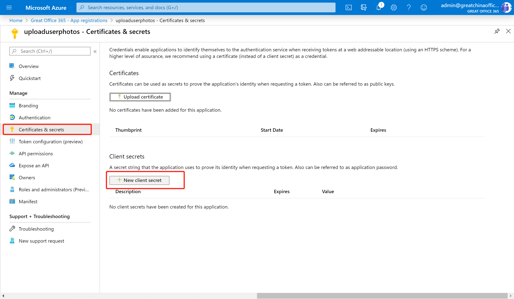
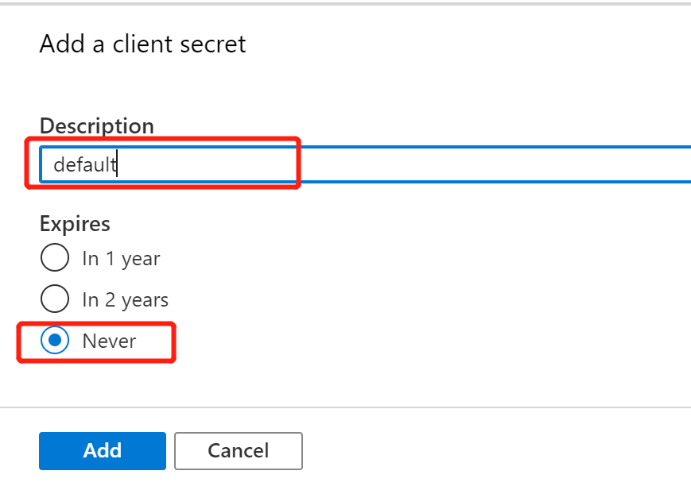
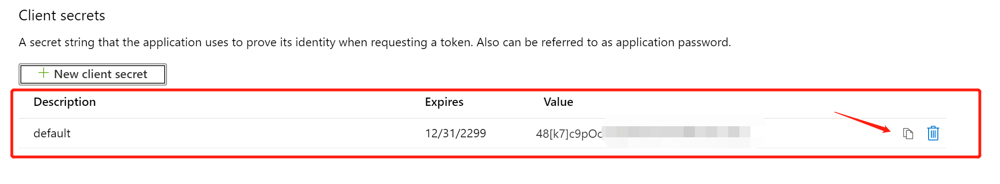
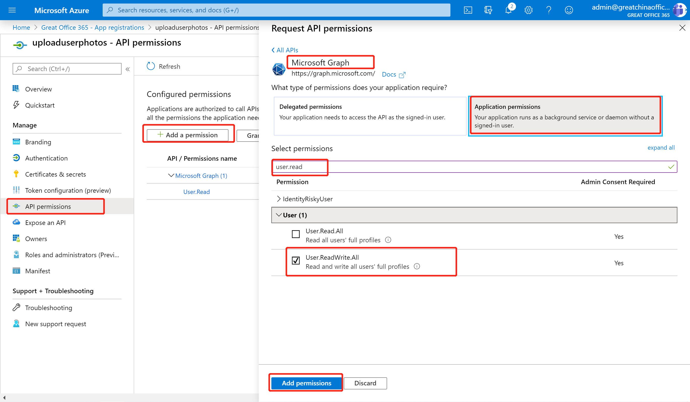
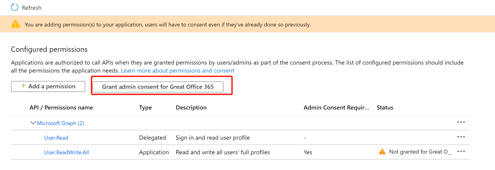

# Upload all users photo to Office 365
> Ares Chen @ 2020-2-8

## Prerequisite

1. Install .NET Core runtime 3.1  
    * [Windows x64](https://download.visualstudio.microsoft.com/download/pr/a1d41522-4da0-42bc-b3f2-e4b7d842974d/03101425368c87c55c1fe7cafbb4e0fb/windowsdesktop-runtime-3.1.1-win-x64.exe)  
    * [Windows x86](https://download.visualstudio.microsoft.com/download/pr/662153d9-58c5-4630-a326-ed9e4e342787/1deb6ba6a2a5f5f694b784a6859b446e/windowsdesktop-runtime-3.1.1-win-x86.exe)

1. Register the Application in Azure Portal

    1. Navigate to the app registration portal with your Office 365 Global administrator account <https://portal.azure.com/?l=en.en-us#blade/Microsoft_AAD_IAM/ActiveDirectoryMenuBlade/RegisteredApps>
    1. Click the "New Registeration" button
        
    1. Type the app name (for example : uploaduserphotos)and leave all other settings by default, then click the "Register" button
        
    1. Copy and save the clientId and tenantId
        
    1. Navigate to the "Certificates & secrets" page and click the "New client secret" button
        
    1. Create a default client secret as below
        
    1. Copy the secret information immediately because you don't have another chance to see it if you refresh the page or goto another page
        
    1. Navigate to the "API permissions" page, add an application permission under Microsoft Graph category, the permission is "User.ReadWrite.All" , click the "Add permissions" button
        
    1. Grant the permission as admin
        
    1. Now, you've registered an application to run, and you've copied three information including the clientId, tenantId, client secret.
1. Prepare all the photos into a single directory, please keep each file small than 4MB, and named with the employee's email address and extension with jpg. for example `ares@greatchinaoffice365.onmicrosoft.com.jpg`

## Download and run 

1. You can download the execuable here : [uploadalluserphoto.zip](uploadalluserphoto.zip) 
1. Unzip the file to your local drive, start a command shell, change the current directory to the folder, then run a command as below 
    `.\updatealluserphoto.exe -i yourclientId -s yourclientsecret -t yourtenantid -d photodirectory`
    > Please change these four parameter to your information
1. Relax and enjoy!

## Feedback

Email : <teamscommunity@microsoft.com>